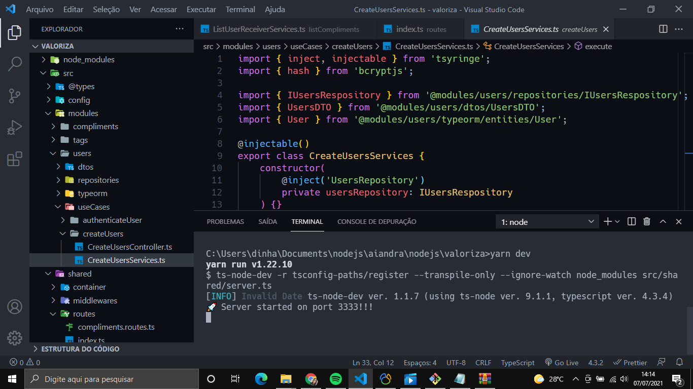

<h1 align="center">Valoriza</h1>

    

## 💻 Projeto

Valoriza é uma plataforma para promover o reconhecimento entre companheiros de equipe.

## ✨ Tecnologias

Esse projeto foi desenvolvido com as seguintes tecnologias:

-   [Node.js](https://nodejs.org/en/)
-   [Typescript](https://www.typescriptlang.org/)
-   [Express](https://expressjs.com/pt-br/)
-   [Typeorm](https://typeorm.io/#/)

## ✅ Regras

-   Cadastro de Usuário

    [ x ] Não é permetido cadastrar mais de um usuário com o mesmo e-mail

    [ x ] Não é permetido cadastrar usuário sem e-mail

-   Cadastro de TAG

    [ x ] Não é permetido cadastrar mais de uma tag com o mesmo nome

    [ x ] Não é permetido cadastrar tag sem nome

    [ x ] Não é permetido o cadastro por usuários que não sejam administradores

-   Cadastro de Elogios

    [ x ] Não é permetido um usuário cadastrar um elogio para si mesmo

    [ x ] Não é permetido cadastrar elogios para usuários inválidos

    [ x ] O usuário precisa estar autenticado na aplicação

## 🚀 Instalação e Configuração do Projeto

1. Criar um Banco de Dados com o Nome: `valoriza`

2. Instale as Dependências: `npm install`

3. Execute as Migrations: `npm typeorm migrations:run`

4. Execute a API: `npm dev`

Por fim, a aplicação estará disponível em `http://localhost:3333`

---

Feito com ❤ por Aiandra Meira 👋🏻 &nbsp;[Portfólio Pessoal](https://aiandralves.com.br)
